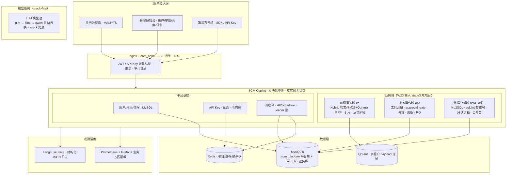

# SCM Copilot · 供应链智能运营平台

> **一站式供应链智能助手：问知识（RAG）· 查数据（NL2SQL）· 办业务（工具+审批）**
> 模块化单体生产平台 ｜ Python 3.12 / FastAPI / LangGraph ｜ 双实例无状态水平扩展 ｜ 统一账号 · 审计 · 调度 · 监控 · 开放 SDK
> 阶段四项目（W23–W26，计划与决策见 [docs](./docs) 与 `learning-outputs/每周计划/阶段四_SCM_Copilot/`）

---

## 一、核心亮点（全部有验收数字）

| # | 亮点 | 量化证据 |
|---|---|---|
| 1 | **NL2SQL 数据分析域**：自然语言查业务库，sqlglot AST 四道闸 + 只读沙箱纵深防御 | 执行准确率 **0.970**（单表 0.975 / join 0.950 / 聚合 1.000）；攻击 **20/20 拦截 0 逃逸**；real P95 38.9ms |
| 2 | **真无状态双实例**：状态全外置 MySQL/Redis，nginx least_conn 水平扩展 | 40 并发成功率 **100% / 5xx=0**；正式基线 30 并发 P95 **1268.8ms**；杀实例演练 210/210 不中断 |
| 3 | **调度数据闭环**：APScheduler 六任务 + Redis leader 锁多实例零重复 | 稳态 **30/30 窗口零重复**；KB 增量同步 ≤5min；夜间回归自动出质量趋势 |
| 4 | **开放生态**：pip SDK + OpenAPI 3.1 + API Key 配额限速 | SDK **13/13** 测试通过（10 行接入）；Swagger 端点覆盖 **100%** |
| 5 | **质量与安全**：pytest **344 passed** / ruff·mypy 0 error；高危写操作 100% 走审批门 + 全量审计 | RBAC 矩阵 12 组全过；成本 **≈¥20**（¥100 预算内） |

> 完整验收清单 18 项（17 达成 + 1 如实标注）见 [reports/acceptance_final.md](reports/acceptance_final.md)；压测终版见 [reports/loadtest_final.md](reports/loadtest_final.md)。

## 二、架构



**设计要点**（决策依据见 [docs/architecture.md](docs/architecture.md) 与 ADR 索引）：

- **模块化单体而非微服务**（ADR-01）：三域 + 平台基座按 API 边界隔离，域间不跨域 import 内部模块，负载特征变化时可按域拆分
- **状态全外置**（ADR-04 前提）：LangGraph checkpointer / 审批 / 会话进 MySQL，幂等 / 缓存 / 锁进 Redis，身份用无状态 JWT → **least_conn 水平扩展的前提**
- **NL2SQL 纵深防御**（ADR-07）：sqlglot AST 四道闸（确定性）→ `nl2sql_ro` 只读账号（DB 权限层兜底）→ 3s 超时 + 行数上限
- **调度零重复**（ADR-05）：调度器全实例跑（高可用）+ Redis leader 锁互斥 + 任务幂等键双保险
- **mock-first**（《04》第 2 节）：开发期全 mock 零成本，real 仅指标采样（总预算 ≤¥100）

## 三、快速开始（约 30 分钟，详见 [docs/deploy.md](docs/deploy.md)）

前置依赖：Docker Desktop（WSL2）、Python 3.12、git、mkcert（本地 TLS）。

```bash
git clone <repo-url> scm-copilot
cd scm-copilot

# 1) 环境 + 依赖
python -m venv .venv
.\.venv\Scripts\activate
pip install -e ".[dev]"
pip install -e ./sdk

# 2) 一键起全栈（mysql/redis/mock-biz/backend×2/nginx，共 10 容器含监控）
make tls        # 本地 TLS 证书（nginx 443 需要）
make up         # docker compose 起全家桶

# 3) 初始化（幂等，可重跑）
make migrate && make seed                       # 平台库 12 表 + 4 角色/3 租户测试用户
make init-biz-db && make migrate-biz && make seed-biz   # 业务库六表 + 万级固定 seed
make monitor    # 起监控栈（prometheus/grafana/node-exporter/cadvisor）

# 4) 冒烟验证（六域 14 项端到端，真实 HTTPS 平台）
make smoke
```

访问入口：

| 入口 | 地址 | 凭证 |
|---|---|---|
| 平台 API（Swagger） | https://localhost:18443/docs | 见下方测试账号 |
| 监控 Prometheus | http://localhost:19090/targets | — |
| Grafana | http://localhost:13001 | `admin` / `admin123` |

测试账号（3 租户 × 4 角色，明文密码统一 `Passw0rd!`，仅开发环境）：

```text
admin_t_huadong    # 全权限（演示用）
operator_t_huabei  # 业务操作域
analyst_t_huanan   # 数据分析域
viewer_t_huadong   # 只读（演示 RBAC 403）
```

> 卸载验证：`docker compose down -v && make up && make seed && make smoke` 从零到可用全流程可复现（Day4 一键起验证记录见 [reports/w26_day4_doc.md](reports/w26_day4_doc.md)）。

## 四、功能全景

| 域 | 能力 | 关键实现 |
|---|---|---|
| **kb 知识问答** | 多轮对话 / 流式 SSE / 引用溯源 / 反馈纠错 / 语义缓存 | Hybrid 检索（BM25+jieba + Qdrant 向量 + RRF k=60）；语义路由 data 分支 |
| **ops 业务操作** | 查单 / 改单 / 取消 / 报表 | 工具注册 + approval_gate（HITL 审批门，before/after diff）；幂等键；熔断器；RQ 队列 |
| **data 数据分析** | 自然语言查数 / 表格+SQL 透出 / 洞察摘要 / 多轮追问 / 错误自修复 | LangGraph 子图 generate→validate→execute→format；Schema Linking 召回（降 token 53%）；四道闸 |
| **调度** | 六任务自动运维（KB 同步/清理/归档/日报/夜间评测/缓存预热） | APScheduler 3 + MySQL job store + Redis leader 锁；24h 零重复可观测 |
| **平台基座** | 统一认证（JWT）/ RBAC / 审计 / API Key / 配额 | 13 权限码；写操作 100% 审计；Redis 令牌桶 429+Retry-After |
| **开放能力** | OpenAPI 3.1 / pip SDK / Swagger | 三接口：`chat_stream` / `nl2sql` / `approvals`，10 行接入 |

```python
from scm_client import ScmCopilot
client = ScmCopilot("https://localhost:18443", token="<jwt>", verify=False)
for ev in client.chat_stream("供应商准入需要哪些资质？"):
    print(ev.delta, end="", flush=True)
result = client.nl2sql("近30天延迟发货 TOP5 供应商", as_dataframe=True)
print(result.sql)                       # SQL 100% 透出，可审计
pending = client.approvals.list_pending()
client.approvals.decide(pending[0].approval_id, "approve", session_id=pending[0].session_id)
```

## 五、验收指标表（与 acceptance_final.md 完全一致）

| 维度 | 指标 | 目标 | 实测 | 判定 |
|---|---|---|---|---|
| 质量 | pytest / 静态检查 | ≥160 全绿 / ruff·mypy 0 | **344 passed / 0 error** | ✅ |
| 质量 | 覆盖率 | ≥75% | 56% | 如实标注（mock-first 纪律，改进路线见 acceptance §十） |
| NL2SQL | 分层执行准确率 | 整体≥0.80 / 单表≥0.95 | **0.970 / 0.975 / 0.950 / 1.000** | ✅ |
| NL2SQL | 注入/越权拦截 | 20/20 | **20/20 拦截 0 逃逸** | ✅ |
| NL2SQL | real 延迟 | P95 ≤5s | **38.9ms** | ✅ |
| 性能 | 并发 | 双实例 40 并发成功率 100% | **100% / 5xx=0**（40 并发 P95 2087ms 如实记录；正式基线 30 并发 P95 1268.8ms） | ✅ |
| 性能 | 问答链路 / 缓存命中 | P95 ≤3s / ≤50ms | 712ms / 1–3ms | ✅ |
| 性能 | 工具成功率 | ≥99% | **三档压测全部 100%** | ✅ |
| 安全 | 高危审批 / 越权 / 审计 | 100% | 审批门 100% + RBAC 12 组全过 + 审计 48 条 | ✅ |
| 闭环 | KB 增量 / 调度零重复 / 夜间回归 | ≤5min / 零重复 / 7 晚 | **≤5min / 30/30 / 2 晚积累中**（时间积累项如实记录） | ✅ |
| 成本 | 月 real spend | ≤¥100 | **≈¥20** | ✅ |
| 生态 | SDK / Swagger | 10 行跑通 / 100% | **13/13 / 端点 100%** | ✅ |

## 六、仓库结构

```text
scm-copilot/
├── backend/            # FastAPI 模块化单体（app/domains/{kb,ops,data,admin} + platform + shared）
├── deploy/             # docker-compose（10 容器）/ nginx / grafana / chaos 故障演练
├── sdk/                # scm-copilot-client（pip 包）
├── docs/               # architecture / deploy（部署手册）
├── reports/            # 周报告 + 验收/压测/演练证据
├── scripts/            # seed / 迁移 / 验证脚本
└── Makefile            # make up/seed/smoke/check/loadtest/drill/chaos-* 一站式入口
```

## 七、非目标（scope 纪律，主动讲边界）

等保正式化、OCR/Whisper、钉钉企微 IM、LoRA 微调、多 GPU、BI 图表引擎、桌面客户端、行业多场景定制——**按生产价值筛选后明确不做，进二期 backlog**（决策依据《06》第 5 节）。

## 八、文档索引

| 文档 | 内容 |
|---|---|
| [docs/architecture.md](docs/architecture.md) | 三域 + 基座设计 / 数据流图 / ADR 索引（8 条） |
| [docs/deploy.md](docs/deploy.md) | 30 分钟部署手册 / 故障排查 |
| [reports/acceptance_final.md](reports/acceptance_final.md) | 验收清单 18 项（含未达项如实标注） |
| [reports/loadtest_final.md](reports/loadtest_final.md) | 压测终版（20/30/40 三档） |
| [reports/chaos_drill.md](reports/chaos_drill.md) | 故障演练五连记录 |
| [reports/demo_10min.md](reports/demo_10min.md) | 10 分钟 demo 讲稿 |
