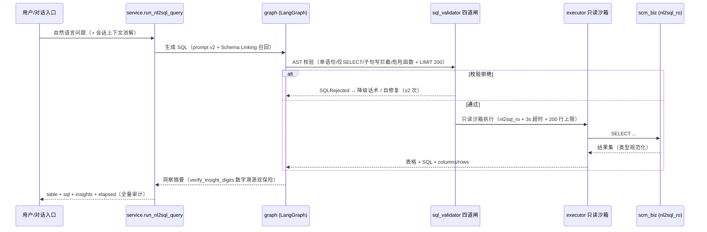
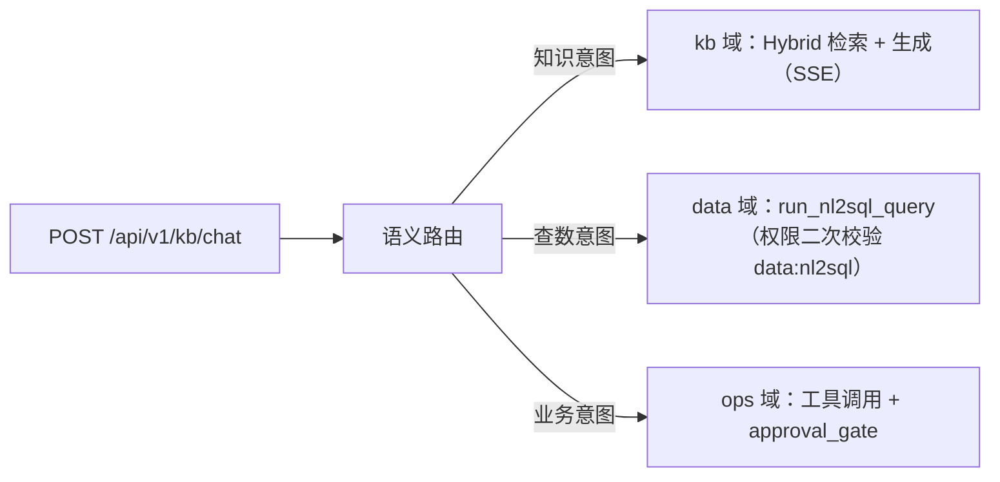
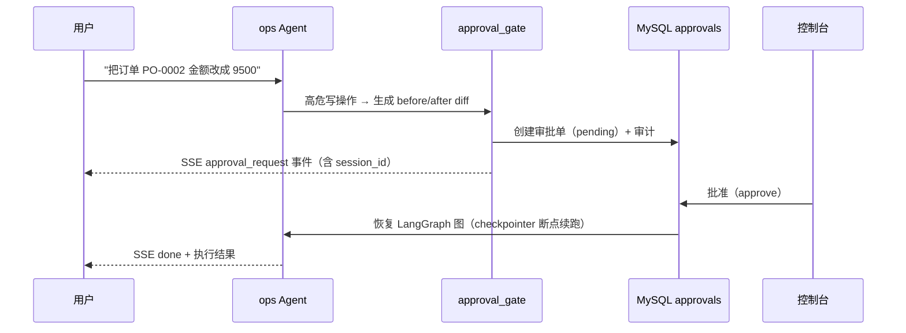

# SCM Copilot 架构设计文档

> 定稿：W26 Day4（2026-09-10）｜ 依据：《02_架构设计与数据模型》《03_核心技术方案》《04_ADR与风险应对》
> 读者：新成员 / 面试官 ｜ 配套：[README 门面](../README.md) · [部署手册](deploy.md)

---

## 1. 定位

**SCM Copilot 供应链智能运营平台**：面向供应链运营团队的一站式智能助手——**问知识（RAG）、查数据（NL2SQL）、办业务（工具+审批）**，统一账号、审计、调度、监控与开放 SDK。

**形态**：模块化单体（Modular Monolith），单 FastAPI 应用按域划分模块，部署为多实例无状态服务。三个业务域 + 一个平台基座，**全部状态外置到 MySQL/Redis**，这是 nginx least_conn 水平扩展的前提（ADR-01 / ADR-04）。

---

## 2. 三域 + 基座设计

### 2.1 知识问答域 `domains/kb`（承 stage3-a）

| 组件 | 职责 |
|---|---|
| `agent/` | 对话 Agent：混合检索 → 重排 → 生成（SSE 四型事件：delta / done / reference / error） |
| `tenant/` | 多租户 payload 过滤（向量检索按 tenant_id 隔离） |
| `feedback/` | 引用纠错 → 审核 → 回流评测集 |
| `mcp_tools/` | 内部工具（语义路由 data 分支等） |
| `security/` | 检索安全（注入拦截） |

检索链路：**Hybrid 检索（BM25+jieba + Qdrant 向量）+ RRF(k=60) 融合**。语义路由规则层（4 组高置信模式 + kNN）将"查数意图"分流到 data 域。

### 2.2 业务操作域 `domains/ops`（承 stage3-b）

| 组件 | 职责 |
|---|---|
| `agent/` | 工具调用 Agent（LangGraph），ops 四工具：query_order / update_order / cancel_order / generate_report |
| `security/` | 高危写操作识别 → `approval_gate`（HITL 审批门，before/after diff） |
| `tasks/` | RQ 异步任务 + 报表队列（队列深度进监控指标） |

可靠性三板斧：**幂等键**（写操作可重放）、**熔断器**（每工具独立三态状态机）、**approval_gate**（高危 100% 走审批，100% 审计）。

### 2.3 数据分析域 `domains/data`（新，W24）

NL2SQL 完整链路（LangGraph 子图）：



**纵深防御（ADR-07）**：
1. **sqlglot AST 四道闸**（确定性，不依赖模型"听话"）：单语句 / 根节点仅 SELECT·UNION / 子句级写操作拦截 / 危险函数黑名单（含混淆绕过）
2. **数据库权限层兜底**：`nl2sql_ro` 只读账号（仅 `GRANT SELECT ON scm_biz.*`），写操作被 MySQL 拒绝（`ERROR 1142`）——即使校验层有未知绕过，权限层兜底
3. **沙箱约束**：3s 超时、行数上限 200、结果集 1MB 截断、类型规范化

**质量机制**：execution accuracy 评测（结果集规范化比对，非字符串比对）；Schema Linking 召回 Top-3 注入（token 降 53%）；错误自修复救回率 0.933；多轮指代消解 9/10。

### 2.4 平台基座 `platform/`

| 模块 | 职责 |
|---|---|
| `auth.py` | JWT 双令牌 + API Key 双轨认证；DB 挂时 fail-open（签名校验是安全边界，查库是增强项） |
| `rbac.py` | 用户-角色-权限三级模型，13 权限码即接口权限 |
| `audit.py` | 全平台写操作审计（actor/event/trace_id），按月归档 |
| `scheduler/` | APScheduler 六任务 + MySQL job store + Redis leader 锁（零重复） |
| `apikeys.py` | sk- 前缀机器身份（sha256 落库）+ Redis 令牌桶限速（429+Retry-After，Redis 挂 fail-open） |
| `hooks.py` | PreToolUse/PostToolUse 工具钩子（参数校验 + 审计 + 缓存失效），故障放行 |
| `conversation.py` | 多轮会话历史（MySQL 持久化） |
| `errors.py` | 统一错误契约 `Err{code,message,trace_id}`（OpenAPI 单一事实来源） |

### 2.5 调度域六任务（数据闭环）

| 任务 | Cron | 职责 | 零重复机制 |
|---|---|---|---|
| `kb_increment_sync` | `*/5` | docs 目录 vs DB 三集合扫描 → 内容寻址幂等 upsert 向量 | point id = uuid5(内容) + 水位 |
| `vector_cleanup` | `0 3` | 孤儿向量清理 + 语义缓存过期成员 | scroll 全量比对 docs 表 |
| `audit_archive` | `0 4 1` | 上月审计按月表归档（CTAS + 校验） | 归档表存在即幂等跳过 |
| `daily_brief` | `0 8 1-5` | 三条固定问题走 NL2SQL 链路 → 模板渲染 → 站内通知 | Redis SETNX + DB unique 双保险 |
| `eval_nightly` | `0 2` | RAG 156 条 + NL2SQL 100 条 mock 全量守护结构 → eval_reports | (report_date, domain) unique |
| `cache_warmup` | `0 7` | 昨日热门会话 TOP100 → 语义缓存预写 | 已命中跳过 |

**多实例零重复**：调度器全实例跑（高可用，实例挂了别人接管）→ 任务触发抢 `SET lock:job:{name} NX EX 300`，未抢到记 `skipped` → 任务级幂等键兜底（即使锁失效也只产生一次副作用）。每次执行写 `scheduler_job_runs`（24h 零重复可观测）。

---

## 3. 数据模型摘要

**两库分离**（Alembic 独立版本树）：

- `scm_platform` 平台库：`users` / `roles` / `permissions` / `role_permissions` / `user_roles` / `audit_logs` / `approvals` / `feedback` / `api_keys` + `quota_usage` / `scheduler_job_runs` / `conversations` / `daily_briefs` / `notifications` / `eval_reports`
- `scm_biz` 业务库（NL2SQL 靶场，固定 seed 可重放）：`suppliers`(40) / `products`(500) / `orders`(10,000) / `order_items`(~35,000) / `shipments`(~7,000) / `inventory`(500)

> DDL 详版见《02》第 3 节；两库通过 `SCM_PLATFORM_DSN` / `SCM_BIZ_DSN` 配置解耦，`nl2sql_ro` 独立只读连接池。

---

## 4. 关键数据流

### 4.1 对话入口语义路由



### 4.2 业务审批链路（HITL）



### 4.3 数据闭环

```
KB 文档变更 --*/5min--> kb_increment_sync --upsert--> Qdrant 向量
用户反馈纠错 --审核--> 评测集回流 --> eval_nightly(02:00) --> eval_reports --> Grafana NL2SQL/RAG 趋势
audit_logs --每月1号--> audit_archive 按月归档
```

---

## 5. ADR 索引（8 条，详版见《04_ADR与风险应对》）

| ADR | 决策 | 一句话理由 |
|---|---|---|
| ADR-01 | 模块化单体而非微服务 | 域间强关联 + 单机约束；域按 API 边界隔离可演进拆分 |
| ADR-02 | MySQL 8 权威库（asyncmy + Alembic） | 并发写/行锁；SQLite 保留为 Redis 故障 fail-open 降级 |
| ADR-03 | 保留 Qdrant + BM25，不迁 Milvus/ES | W5 压测 432 QPS/P95 27ms；单容器运维轻 |
| ADR-04 | ip_hash → least_conn | 状态全外置后粘滞路由无意义且负载不均 |
| ADR-05 | APScheduler + Redis 锁而非 Celery beat | 已有 RQ；任务级互斥已够 |
| ADR-06 | checkpointer = AsyncMySQLSaver | 复用主库；HITL 断点与业务库同源 |
| ADR-07 | sqlglot AST 校验而非正则 | AST 确定性解析无逃逸；正则可被注释/编码绕过 |
| ADR-08 | SDK 薄封装 httpx 而非代码生成 | 三接口手写更可控；端点增后再切生成 |

**ADR 修订记录**（执行中追加，不删原文）：
1. W25 Day6 钩子故障 = 放行（横切关注点故障隔离）
2. W25 Day6 SDK 增加 `verify` 参数
3. W26 Day2 认证存储依赖 = fail-open（DB 挂时信任 JWT claims，签名校验是安全边界）
4. W26 Day2 LLM 降级链守接口契约（generate_json 降级返回结构化 dict 带 degraded 标记）

---

## 6. 演进路径（面试讲"从 X 到 Y"）

1. **stage3 双项目 → 平台**（W23）：SQLite 单实例 → MySQL 双库 + 状态全外置 + 双实例 least_conn（109 项旧回归全过，迁移校验和比对）
2. **平台 → 数据分析域**（W24）：NL2SQL 从 0 到 0.970（Schema Linking / 四道闸 / 自修复 / execution accuracy 评测）
3. **平台 → 调度 + 开放能力**（W25）：六任务数据闭环 + OpenAPI/SDK/API Key（零重复 30/30）
4. **二期 backlog**（已规划未实施）：Runtime 内核 / BI 图层 / IM 集成 / 多租户隔离增强——见《04》执行日志

> 边界诚实（反 Demo 化四原则）：每个数字有测量方法、可复现、未达如实标注、有根因与改进路线。未达项：coverage 56%（mock-first 纪律）、40 并发 P95 2087ms（R5 单机资源，正式基线取 30 并发）、夜间回归 2 晚积累中（时间积累指标）。
