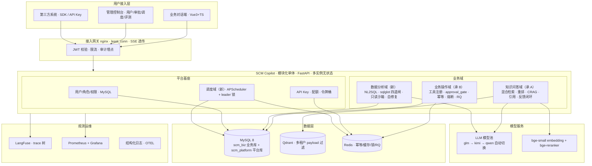

# 02 · 架构设计与数据模型

> 使用场景：W1 建仓（D1–D2 建模）、W2 D7 业务库定稿、任何时点需要回看整体架构或 API 边界。
> 关联执行日：D1（compose）、D2（平台库 DDL）、D4（双域并入路由）、D7（业务库六表）、D16（OpenAPI 规范化）。

---

## 1. 定位与用户故事

**一句话定位**：面向供应链运营团队的一站式智能助手——**问知识（RAG）、查数据（NL2SQL）、办业务（工具+审批）**，统一账号、统一审计、统一运维，可被内部系统通过 SDK 集成。

四类用户的典型故事：

- **运营专员**："华东北区上周延迟发货的订单有哪些？为什么 W-2041 被标记异常？" —— 数据分析域 + 知识问答域协同
- **采购主管**："把订单 SO-20260815-0032 的金额从 12,800 改为 11,500" —— 业务操作域，高危写操作触发审批（带 before/after diff）
- **平台管理员**：在控制台管理用户与角色、处理审批与反馈纠错、查看调度任务与评测看板
- **内部系统开发者**：pip 安装 SDK，10 行代码接入流式问答与数据查询，按 API Key 配额计费

---

## 2. 总体架构

采用**模块化单体（Modular Monolith）**：单 FastAPI 应用按域划分模块，域间只经内部 API 通信；部署为多实例无状态服务。不上微服务的理由与演进路径见 [04 ADR-01](04_ADR与风险应对.md)。



要点：三个业务域 + 一个平台基座，**全部状态外置到 MySQL/Redis**，因此实例可水平扩展（least_conn 前提）。

---

## 3. 数据模型（MySQL 核心 DDL）

两库分离：

- `scm_platform` —— 平台库：身份、审批、审计、调度、配额
- `scm_biz` —— 业务库：由 mock_biz_server 三表演进 + 种子数据生成器固定 seed（规模：订单 10,000 / 明细 30,000 / 商品 500 / 供应商 40）

### 3.1 平台库（用户-角色-权限三级模型）

```sql
-- scm_platform（MySQL 8.0 · utf8mb4 · InnoDB）
CREATE TABLE users (
  id            BIGINT UNSIGNED AUTO_INCREMENT PRIMARY KEY,
  username      VARCHAR(64) NOT NULL UNIQUE,
  password_hash VARCHAR(97) NOT NULL COMMENT 'bcrypt',
  tenant_id     VARCHAR(32) NOT NULL COMMENT '多租户隔离键',
  status        TINYINT NOT NULL DEFAULT 1,
  created_at    DATETIME(3) NOT NULL DEFAULT CURRENT_TIMESTAMP(3)
) ENGINE=InnoDB;

CREATE TABLE roles (
  id   INT UNSIGNED AUTO_INCREMENT PRIMARY KEY,
  code VARCHAR(32) NOT NULL UNIQUE COMMENT 'admin / operator / analyst / viewer',
  name VARCHAR(64) NOT NULL
) ENGINE=InnoDB;

CREATE TABLE permissions (
  id     INT UNSIGNED AUTO_INCREMENT PRIMARY KEY,
  code   VARCHAR(64) NOT NULL UNIQUE COMMENT 'kb:chat / ops:order:update / data:nl2sql / admin:user:manage',
  domain VARCHAR(16) NOT NULL COMMENT 'kb / ops / data / admin'
) ENGINE=InnoDB;

CREATE TABLE role_permissions (
  role_id INT UNSIGNED NOT NULL,
  permission_id INT UNSIGNED NOT NULL,
  PRIMARY KEY (role_id, permission_id)
) ENGINE=InnoDB;

CREATE TABLE user_roles (
  user_id BIGINT UNSIGNED NOT NULL,
  role_id INT UNSIGNED NOT NULL,
  PRIMARY KEY (user_id, role_id)
) ENGINE=InnoDB;
```

伴随表（D2 一并建）：

| 表 | 用途 |
|---|---|
| `audit_logs` | 全平台写操作审计（按月表归档，见调度任务 audit_archive） |
| `approvals` | 审批单，含 before/after diff JSON |
| `feedback` | 引用纠错 / SQL 纠错回流 |
| `api_keys` + `quota_usage` | SDK 机器身份与配额记账 |
| `scheduler_job_runs` | 调度任务运行记录（防重与可观测） |
| `conversations` | 多轮会话历史 |

种子数据（固定 seed，幂等脚本）：4 角色（admin / operator / analyst / viewer）+ 权限码（`kb:chat` / `ops:order:update` / `data:nl2sql` / `admin:*`）+ 3 租户测试用户。

### 3.2 业务库（六表）

```sql
-- scm_biz：mock_biz_server 的 orders/inventory/suppliers 三表演进为六表
CREATE TABLE orders (
  id          BIGINT UNSIGNED AUTO_INCREMENT PRIMARY KEY,
  order_no    CHAR(16) NOT NULL UNIQUE,
  supplier_id INT UNSIGNED NOT NULL,
  region      ENUM('华东','华北','华南','西南') NOT NULL,
  status      ENUM('draft','paid','shipped','done','cancelled') NOT NULL,
  amount      DECIMAL(12,2) NOT NULL,
  created_at  DATETIME(3) NOT NULL DEFAULT CURRENT_TIMESTAMP(3),
  KEY idx_status_created (status, created_at),
  KEY idx_region (region)
) ENGINE=InnoDB;

-- 伴随表：order_items / products / suppliers / inventory / shipments
```

设计要点：
- 状态枚举与 mock_biz_server 状态机一致（draft→paid→shipped→done，cancelled 旁路），种子生成器保证流转合法
- `idx_status_created` 复合索引服务高频查询模式（"近 N 天某状态的订单"）
- 索引设计配合 Schema Linking 评测（join 类问题集中在 orders↔order_items↔products / orders↔suppliers 链）

### 3.3 NL2SQL 只读沙箱账号

```sql
-- 只读账号（NL2SQL 沙箱执行专用，与校验闸门构成双保险）
CREATE USER 'nl2sql_ro'@'%' IDENTIFIED BY '***';
GRANT SELECT ON scm_biz.* TO 'nl2sql_ro'@'%';   -- 仅 SELECT，无锁表/写权限
```

执行器配套约束：3s 超时、行数上限 200、结果集截断保护（详见 [03 核心技术方案](03_核心技术方案.md)）。

---

## 4. 关键 API 一览

| 分组 | 端点 | 说明 |
|---|---|---|
| auth | `POST /api/auth/login` · `/refresh` · `/logout` | JWT 双令牌；登录写 audit_logs |
| chat | `POST /api/chat/stream` | 统一对话入口（SSE），语义路由分域 |
| chat | `GET /api/conversations/{id}` | 多轮会话历史（MySQL 持久化） |
| kb | `POST /api/kb/feedback` | 引用纠错 → 审核 → 回流评测集 |
| ops | `POST /api/ops/approvals/{id}/decision` | 审批决策；resume LangGraph 图 |
| data | `POST /api/data/query` | NL2SQL；返回 表格 + SQL + 引用表 |
| data | `POST /api/data/query/{id}/feedback` | SQL 纠错样本回流 |
| admin | `GET/POST /api/admin/users` · `/roles` | 用户角色管理（权限码即接口权限） |
| admin | `GET /api/admin/scheduler/jobs` | 任务状态/上次运行/下次触发 |
| admin | `POST /api/admin/scheduler/jobs/{name}/trigger` | 手动触发（审计） |
| open | `GET /openapi.json` · `/docs` | OpenAPI 3.1 + Swagger UI 三分组 |
| ops | `GET /metrics` · `/health` | Prometheus 抓取 / 存活探针 |

放行清单（不走 JWT）：`/health`、`/docs`、`/metrics`。

---

## 5. 仓库结构（D1 建仓定稿）

```
scm-copilot/
├── backend/            # FastAPI 模块化单体
│   ├── domains/
│   │   ├── kb/         # 知识问答域（承 stage3-a）
│   │   ├── ops/        # 业务操作域（承 stage3-b）
│   │   └── data/       # 数据分析域（新，NL2SQL）
│   ├── platform/       # 平台基座：auth / rbac / audit / scheduler / quota
│   └── shared/         # llm / rag / reliability 共享包
├── frontend/           # Vue3 + Vite + TS（对话端 + 管理控制台）
├── deploy/             # docker-compose / nginx / mkcert 证书
├── sdk/                # scm-copilot-client 包
└── docs/               # 架构文档 / 部署手册 / ADR
```

域间协作纪律（对应 Harness s15–s18 执行隔离）：**域间只经 API/事件通信，不共享内存状态，不跨域 import 内部模块**——为未来按域拆分服务保留边界。
