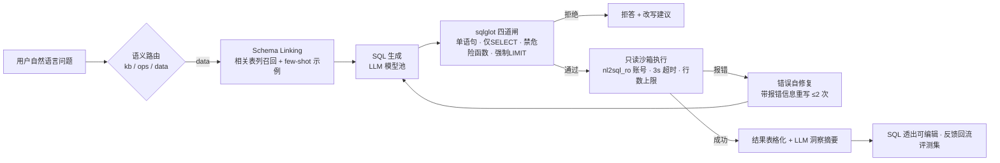

# 03 · 核心技术方案：NL2SQL / 调度域 / SDK / 无状态化

> 使用场景：第 2 周（D7–D12 NL2SQL 全程）、第 3 周（D13–D18 调度与 SDK）、第 1 周末（D5–D6 无状态化核销）开发时对照实现。
> 安全闸代码、六任务定义、SDK 接口契约的**唯一权威版本**（原 HTML 5.4–5.6 已全部并入本篇）。

---

## 1. 数据分析域：NL2SQL 流水线

项目的技术纵深所在，也是安全设计的关键战场。流水线七步 + 四道安全闸：



> 安全边界不依赖模型"听话"，而是 **AST 确定性校验 + 数据库层只读账号双保险**。

### 1.1 安全闸核心实现（sqlglot AST 白名单）

```python
import sqlglot
from sqlglot import exp

ALLOWED_ROOT = (exp.Select, exp.Union)
FORBIDDEN_FUNCS = {"sleep", "benchmark", "load_file", "outfile"}

def validate_sql(sql: str) -> str:
    stmts = sqlglot.parse(sql, read="mysql")
    if len(stmts) != 1:                                   # 闸1：禁止多语句（防 ; 堆叠注入）
        raise SQLRejected("multi-statement")
    tree = stmts[0]
    if not isinstance(tree, ALLOWED_ROOT):                # 闸2：仅 SELECT / UNION
        raise SQLRejected("not-select")
    if tree.find(exp.Insert, exp.Update, exp.Delete,
                 exp.Drop, exp.Alter, exp.Create, exp.Grant):
        raise SQLRejected("write-op")                     # 闸3：子句级写操作拦截
    if any(f.sql_name().lower() in FORBIDDEN_FUNCS
           for f in tree.find_all(exp.Func)):
        raise SQLRejected("dangerous-func")               # 闸4：危险函数黑名单
    if not tree.args.get("limit"):
        tree.limit(200)                                   # 兜底：强制 LIMIT 防全表扫描
    return tree.sql(dialect="mysql")
```

实现坑（D8 注意）：
- `read="mysql"` 方言必传，否则 `LIMIT 200 OFFSET ...` 等语法解析漂移
- `exp.Union` 判定要覆盖 `UnionAll`（UNION ALL 也是合法根节点）
- 20 条攻击用例必配：堆叠语句、注释截断、SELECT 嵌写、union 探测、sleep 拖库、大小写/编码混淆——要求 20/20 拦截 0 逃逸

### 1.2 评测方法论

- **评测集**：100 条，固定 seed 生成，三层分布——单表过滤 40 / 多表 join 40 / 聚合分组 20
- **指标**：execution accuracy（**结果集比对，而非 SQL 字符串比对**——同义 SQL 应判对）。结果集规范化：排序键 + 类型归一后比对
- **攻击用例**：20 条注入/越权（堆叠、注释截断、写操作伪装、sleep 注入），要求 100% 拦截
- **演进节奏**：D9 先 50 条（单表 30/join 20）建基线 → D10 join 补到 40 → D12 扩满 100 条三层 + real 全量采样

### 1.3 Schema Linking（D10）

- 表/列业务描述向量化（复用 bge-small），问题 → 相关表召回（Top-3）→ 只注入相关 schema
- Prompt v2 = 召回表 + 精简 few-shot；记录 token 消耗对比（全 schema vs linking）
- 验收：linking 召回准确率 ≥90%（该出现在上下文的表）+ token 下降 ≥50%

### 1.4 生成链路增强（D11–D12）

| 能力 | 设计 | 验收 |
|---|---|---|
| 错误自修复 | 执行报错信息回喂重写 ≤2 次；仍失败降级为"改写建议"话术（不硬答） | 报错样本救回率 ≥50% |
| 多轮追问 | 指代消解（"那华南呢？"→补全省份条件）+ 会话上下文注入 | 多轮用例 10 条过 8 |
| 结果呈现 | 表格化 + LLM 洞察摘要（≤3 条）+ SQL 折叠面板（可复制可纠错）+ 反馈回流入口 | SQL 100% 透出可审计 |

---

## 2. 调度域：APScheduler 六任务

| 任务 | 调度（cron） | 作用 | 防重 / 幂等机制 |
|---|---|---|---|
| `kb_increment_sync` | `*/5 * * * *` | docs 表 mtime 增量 → 重切块重嵌入 → Qdrant upsert（uuid5 幂等） | Redis leader 锁 + uuid5 内容寻址 |
| `vector_cleanup` | `0 3 * * *` | 清理孤儿/过期向量与失效缓存键 | leader 锁 + 删除幂等 |
| `audit_archive` | `0 4 1 * *` | 审计日志按月归档表，主表瘦身 | leader 锁 + 归档批次号 |
| `daily_brief` | `0 8 * * 1-5` | NL2SQL 生成经营日报（GMV/延迟率/TOP 供应商）→ 订阅用户站内推送 | leader 锁 + 日期幂等键 |
| `eval_nightly` | `0 2 * * *` | RAG 156 条 + NL2SQL 100 条评测集全量回归 → 报告落库 | leader 锁 + 结果快照 |
| `cache_warmup` | `0 7 * * *` | 按昨日热度预热语义缓存 TOP100 | leader 锁 |

### 多实例防重机制（面试高频）

APScheduler 以 **MySQL 为 job store**（任务定义持久化，重启不丢），每类任务触发时先抢 Redis 锁：

```
SET lock:job:{name} {owner} NX EX 300
```

owner 校验沿用 B 项目分布式锁实现；未抢到的实例本轮跳过。

**设计原则：调度器全实例运行、任务级互斥**——比"单实例跑调度"更高可用（实例挂了另一个自动接管）。再加任务幂等键（如日报用日期作键）双保险：即使锁失效重复执行也只产生一次副作用。

落位：FastAPI lifespan 启动调度器；运行记录写 `scheduler_job_runs` 表；管理控制台提供任务状态 / 上次运行 / 下次触发 / 手动触发（触发写审计）。

---

## 3. 开放能力与 SDK（D16–D17）

### 3.1 OpenAPI 规范化

- 三分组 tag：`chat`（对话）/ `ops`（业务操作）/ `data`（数据查询）+ `admin`
- 统一错误码 schema：`{code, message, trace_id}`
- 响应模型 100% 类型注解；导出 OpenAPI 3.1 JSON
- Swagger `/docs` 验收清单：每个端点有描述、参数示例、错误响应

### 3.2 SDK（scm-copilot-client）

薄封装 httpx（零重依赖），同步方法 + SSE 迭代器两种风格，`pyproject.toml` 打包，发布 TestPyPI：

```python
# pip install scm-copilot-client
from scm_client import ScmCopilot

client = ScmCopilot("http://localhost:8000", api_key="sk-xxx")

for event in client.chat_stream("上季度华东区供应商的付款异常订单有多少？"):
    print(event.delta, end="", flush=True)        # SSE 迭代器：流式输出

result = client.nl2sql("近30天延迟发货 TOP5 供应商", as_dataframe=True)
print(result.sql)                                  # 透出生成 SQL，可审计可纠错
```

三接口契约：`chat_stream`（SSE 迭代器）、`nl2sql`（表格 + SQL）、`approvals`（审批决策）。

### 3.3 API Key 与配额

- API Key 是与用户 JWT 并存的**机器身份**：生成/吊销走 admin 接口
- Redis 令牌桶按 Key 限速；超额返回 `429 + Retry-After`
- `quota_usage` 表记账，usage 按模型分别统计可追溯

验收：干净虚拟环境 `pip install` 后 10 行代码跑通"流式问答 + 数据查询 + 审批"；429 用例过。

---

## 4. 无状态化核销清单（D6 逐项打勾）

从"假水平扩展"（ip_hash 粘滞）到"真无状态"（least_conn）的前提——每一项状态都有外置归宿：

| 状态 | 旧位置（stage3） | 新归宿 | 核销日 |
|---|---|---|---|
| 会话身份 | 进程内存 session | 无状态 JWT（15min access + 24h refresh） | D3 |
| 会话历史 | SQLite / 进程内 | MySQL `conversations` | D5 |
| LangGraph 断点 | SQLite checkpointer | `AsyncMySQLSaver`（与业务库同源） | D5 |
| 审批单 | SQLite | MySQL `approvals`（含 before/after diff） | D5 |
| 幂等 / 缓存 / 锁 | 单实例 Redis db 隔离 / 进程字典 | Redis 共享（语义缓存 keys 迁移） | D5 |
| 调度任务定义 | 无 | MySQL job store | D13 |

核销完成后：nginx `ip_hash` → `least_conn`，compose 扩 backend 双实例，压测 + 杀实例演练（复用 `load_test.py`）。

> 语义缓存 keys 迁移注意：原进程内字典/单实例 Redis db 隔离要清理干净，否则双实例出现"缓存视图不一致"——一个实例写入另一个实例看不到，命中率虚低。

---

## 5. 数据迁移方案（D5）

一次性脚本：审批单 / 反馈 / 审计 SQLite→MySQL。

1. 迁移前后**行数比对** + 关键字段**校验和比对**（不只对总数，逐表 checksum）
2. 迁移脚本幂等（可重跑，按主键 upsert）
3. 迁移后验证 HITL 场景：审批中断 → 重启 → resume 在新存储上跑通（复用 W2 场景）
4. LangGraph checkpointer 切换后，历史会话可继续（同 thread_id 续跑验证）

---

## 6. 故障演练五连（D20，验收降级链）

| 故障 | 预期降级行为 |
|---|---|
| 杀 MySQL | 审批暂停不雪崩；恢复后续跑（断点在 checkpointer） |
| 杀 Redis | fail-open 降 SQLite（沿用 B 项目模式） |
| 杀 Qdrant | 检索降级 BM25-only |
| LLM 全超时 | 模型池切换 → mock 兜底话术 |
| 实例半瘫 | least_conn 摘除，流量自动集中健康实例 |

验收：5/5 场景自动降级不雪崩，恢复后自动回归，当天修复演练暴露的问题。
